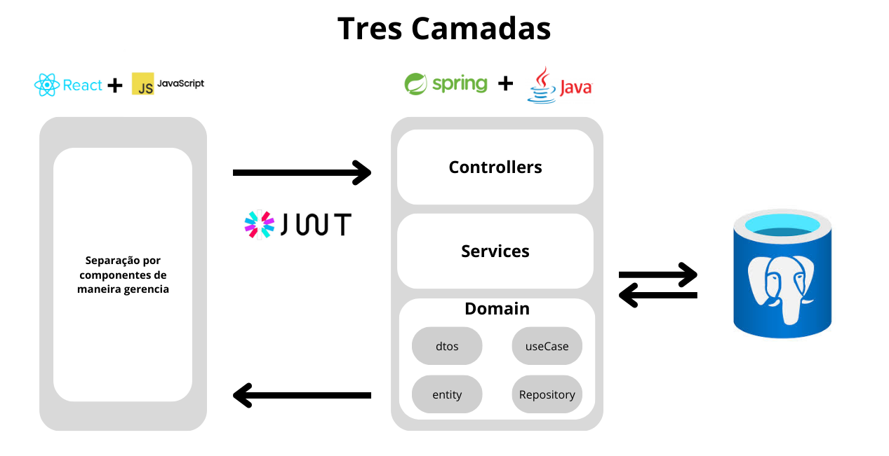
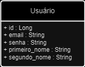
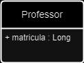
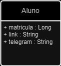
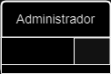
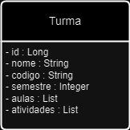
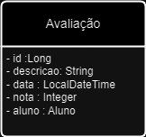
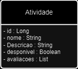

## Diagramas de Classe e de Atividade

Este repositório contém os diagramas que representam a estrutura e o fluxo de atividades do nosso sistema.

### Diagrama de Classe

O diagrama de classe fornece uma visão geral das entidades e relacionamentos no sistema. Este diagrama é uma representação estática da estrutura do sistema, mostrando as classes, seus atributos e métodos, bem como as relações entre elas.

- [Link para o Diagrama de Classe](https://drive.google.com/file/d/1vWNx628R4ReCDQqqT5ygoukLAJcE5A9M/view?usp=sharing)

  > **Nota:** Este diagrama pode ser sujeito a alterações conforme o projeto avança e novas necessidades surgem.

### Diagrama de Atividade

O diagrama de Atividade de acordo com os requisitos elicitados do projeto esta disponível em 

- [Link para o Digrama de Atividades](https://drive.google.com/file/d/1t5F50NXE7QOQRADiIpuY9_WHs3lz7BEF/view?usp=sharing)

  > **Nota:** Este diagrama está sujeito a atualizações à medida que o projeto avança e novas necessidades são identificadas. Recomendamos que revisões periódicas sejam realizadas para assegurar que ele reflita com precisão o estado atual do sistema.

#### Visão Geral do Diagrama de Atividades 
  O diagrama captura as interações entre os diferentes atores do sistema (alunos e professores) e as ações que eles realizam para completar as tarefas mencionadas. O fluxo de atividades é projetado para maximizar a usabilidade e eficiência, garantindo que as ações sejam intuitivas e o sistema responda de forma previsível.

  * Sequência Lógica: As atividades são organizadas de maneira sequencial e lógica, refletindo o fluxo típico de trabalho dos usuários. Cada decisão ou bifurcação no fluxo é claramente representada, com as condições que levam a cada caminho bem definidas.

  * Simplicidade e Clareza: O diagrama foi desenhado com um foco na simplicidade e clareza, assegurando que todos os processos sejam facilmente compreendidos. Isso é particularmente importante para garantir que tanto desenvolvedores quanto partes interessadas não técnicas possam interpretar o diagrama corretamente.

  * Flexibilidade: Apesar de focado nas funcionalidades principais, o diagrama foi elaborado para ser flexível o suficiente para acomodar futuras expansões e modificações, conforme novas funcionalidades sejam incorporadas ao sistema.

### Arquitetura do sistema

A arquitetura do sistema consiste em uma arquitetura de três camadas que é uma estrutura que separa as responsabilidades do sistema em três partes, o que torna o desenvolvimento mais organizado, flexível e escalável.

> **Nota:** Este diagrama pode ser sujeito a alterações conforme o projeto avança e novas necessidades surgem.

### 1. Camada de Apresentação(Front end)

Esta é a parte que o usuário vê e interage diretamente. Aqui utilizaremos o React como framework para nos ajudar no desenvolvimento e que fara conexão com a Rest Api.

### 2. Camada de Lógica de Negócio(Back end)

É o cérebro da aplicação. Aqui está toda a lógica que governa como os dados devem ser manipulados e processados. Utilizamos Uma Api Rest com o Framework Spring Boot para receber requisições do front-end, processar e decidir o que fazer a seguir, como armazenar ou consultar dados no banco de dados. Aqui também fazemos uso do JWt(token para requisições) e definimos resgras para usuários.

### 3. Camada de Dados (Banco de dados)

É a camada responsável por fazer a percistencia dos dados e que fiquem seguras se comunicando unicamente com o back end. Criando em PostgreSql por ser um projeto consistente e open source, tendo uma comunidade grande e dedica. Garantindo a confiabilidade.

### Diagramas de Entidade

Aqui estão os diagramas que representam diferentes tipos de entidades no sistema:

#### Usuário

#### Professor (Herda de Usuário)

#### Aluno (Herda de Usuário)

#### Administrador (Herda de Usuário)

#### Turma

#### Avaliação

#### Atividade

Estes diagramas fornecem uma compreensão visual das entidades principais e suas relações dentro do sistema, ajudando no processo de desenvolvimento e comunicação entre os membros da equipe.
